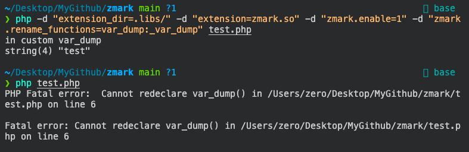

# zmark

[](https://travis-ci.org/SSRFuzz/zmark)
[](https://ci.appveyor.com/project/SSRFuzz/zmark/)


## 目录

* [介绍](#介绍)
* [安装](#安装)
* [例子](#例子)
* [API](#api)
* [OPCODE](#opcode)
* [PHP 配置](#php-配置)
* [注意事项](#注意事项)
* [Ref](#ref)


### 介绍

一个 PHP7 扩展，所提供的功能为：

* 能够对字符串变量进行打标记
* 能够 Hook 绝大多数函数/类
* 能够 Hook 部分 opcode

### 安装

* linux/macOS:

```
phpize
./configure
make
```

* windows

[download](https://github.com/SSRFuzz/zmark/releases)

### 例子

代码：
``` php
<?php

function var_dump(...$args) {
    echo "in custom var_dump\n";
    _var_dump(...$args);
}

var_dump("test");
```

运行：

`php -d "extension_dir=/tmp/modules/" -d "extension=zmark.so" -d "zmark.enable=1" -d "zmark.rename_functions=var_dump:_var_dump" test.php`

运行结果：




更多例子，可以看[tests](https://github.com/SSRFuzz/zmark/tree/master/tests)

### API

* 给字符串变量打标记
```
bool zmark(string &$str);
```

* 检查字符串变量是否打上标记
```
bool zcheck(string &$str);
```

* 清除字符串变量上的标记
```
bool zclear(string &$str);
```

* 更改用户函数的名字
```
bool zrename_function(string $old_name, string $new_name);
```

* 更改用户类的名字
```
bool zrename_class(string $old_name, string $new_name);
```

* 注册 opcode callback

```
bool zregister_opcode_callback(int $opcode, string $callback);
```
$callback 必须是一个函数名, 不能是一个类方法, 也不能是其他 callable。


### OPCODE

每个 opcode callback 的格式都不一样，返回格式也不一样，所以我们一个一个讲解。

* `ZMARK_ECHO`
```
void echo_handler(string $string)
```

* `ZMARK_EXIT`
```
void exit_handler(string $string)
```

* `ZMARK_INIT_METHOD_CALL`
```
void init_method_call_handler(string $funcname)
```

* `ZMARK_INIT_USER_CALL`
```
void init_user_call_handler(string $funcname)
```

* `ZMARK_INIT_DYNAMIC_CALL`
```
void init_dynamic_call_handler(string $funcname)
```

* `ZMARK_INCLUDE_OR_EVAL`
```
void include_or_eval_handler(string $code_or_file)
```

* `ZMARK_CONCAT`
```
string concat_handler(string $param1, string $param2)
```

* `ZMARK_FAST_CONCAT`
```
string fast_concat_handler(string $param1, string $param2)
```

* `ZMARK_ASSIGN_CONCAT`
```
string assign_concat_handler(string $param1, string $param2)
```

* `ZMARK_ROPE_END`
```
void rope_end_handler(array $params)
```

* `ZMARK_DO_FCALL`
```
void do_fcall(string $call, array $params)
```

* `ZMARK_DO_ICALL`
```
void do_icall(string $call, array $params)
```

* `ZMARK_DO_UCALL`
```
void do_ucall(string $call, array $params)
```

* `ZMARK_DO_FCALL_BY_NAME`
```
void do_fcall_by_name(string $call, array $params)
```

### PHP 配置

我们可以通过在配置文件启用 `zmark` 扩展：

```
zmark.enable = 1
```

可通过配置文件启用重命名 PHP 用户函数/类 (不建议在生产环境中启用)
```
zmark.enable_rename = 1
```

也可以通过配置文件重命名 PHP 内部函数：
```
zmark.rename_functions="
    phpinfo:vgfuzzer_phpinfo,
    system:vgfuzzer_system
"
```

还可以通过配置文件重命名 PHP 内部类：

```
zmark.rename_classes="
    PDO:vgfuzzer_POD,
    yyy:_yyy
"
```

在配置文件中修改函数或类的格式为 `origin_name:new_name`，如果有多个修改项，请用 `,` 进行分割。


### 注意事项

1. `str_replace`

`str_replace` 的函数描述如下：
```
mixed str_replace ( mixed $search , mixed $replace , mixed $subject [, int &$count ] )
```

其中 $count 是一个引用参数，所以在 Hook `str_replace` 函数正确的方法是这样：
```php
function str_replace($search, $replace, $subject, &$count=NULL) {
    return call_user_func_array("origin_str_replace", array($search, $replace, $subject, &$count));
}

str_replace("a", "e", "hallo world", $count);
var_dump($count);
```

所以如果想 Hook 其他参数中有引用参数的函数，请使用这样的方法。

2. `strval`

`zmark` 并不能 Hook `strval` 函数，是因为在 compile 阶段 `strval` 直接就优化处理了，并不需要通过 `EG(function_table)` 进行查找，
同样的函数还有 [zend_compile.c](https://github.com/php/php-src/blob/PHP-7.2.10/Zend/zend_compile.c#L3872)

3. `getallheaders`

`zmark` 并不能 Hook `getallheaders` 函数，是因为 `getallheaders` 函数是 `sapi_module` 内的函数，
而 `sapi_module` 比 `php_extension` 和 `zend_extension` 初始化时间都晚，
所以 `sapi_module` 内的函数都无法使用 `zmark` 进行 Hook，幸运的是 `sapi_module` 里面就只有几个函数而已。

4. `extract`

`zmark` 能够 Hook `extract` 函数，但会影响 `extract` 原有功能，
因为 `extract` 的原有功能会影响调用 `extract` 空间的 variable scope，
`extract` 会查找调用栈中最后一个 user function，然后修改其 variable scope，
当我们更改 `extract` 名字，直接使用 PHP 编写另外一个 `extract` 函数的时候，
我们所编写的 `extract` 函数就是最后一个 user function，所以 `extract` 原有的功能就会失效。

类似的还有其他函数: [Forbid dynamic calls to scope introspection functions](http://php.net/manual/zh/migration71.incompatible.php#migration71.incompatible.forbid-dynamic-calls-to-scope-introspection-functions)

如果只是需要监控这些函数的调用，那么我建议使用 opcode callback 去做。

5. `array_map`

`zmark` 也能够 Hook `array_map` 函数，但也可能会影响 `array_map` 原有功能，
因为 `array_map` 调用 callback 的时候，会判断调用 `array_map` 所在的函数是否有权限调用对应的 callback。

举个具体例子：
``` php
<?php

function test($callable, $arr) {
    array_map($callable, $arr);
}


class A {
    public function hi() {
        test(array($this, 'hello'), array(1, 2));
    }

    private function hello() {
        echo "hello\n";
    }
}


$a = new A();
$a->hi();
```
当在方法中调用 `array_map` 的时候，会使用 `zend_get_executed_scope` 查找调用栈中最后一个 user function，
然后判断这个 user function 是否有权限调用 callback，所以可能会导致 `array_map` 调用失败，
同样的问题还出现在其他接受 callback 参数的 internal function 中。

总而言之，如果一个函数依赖或者将改变调用者的 scope，那就要仔细判断该函数还能不能直接进行 Hook。


### 引用

* [taint](https://github.com/laruence/taint)
* [xmark](https://github.com/SSRFuzz/xmark)